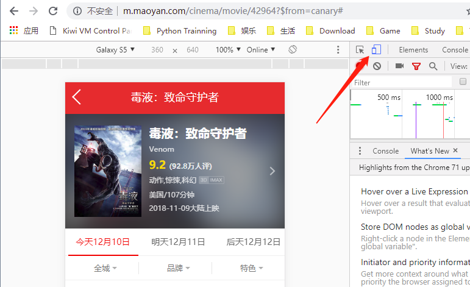
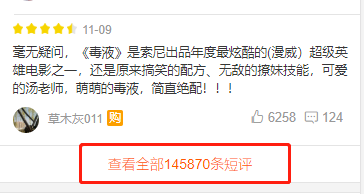
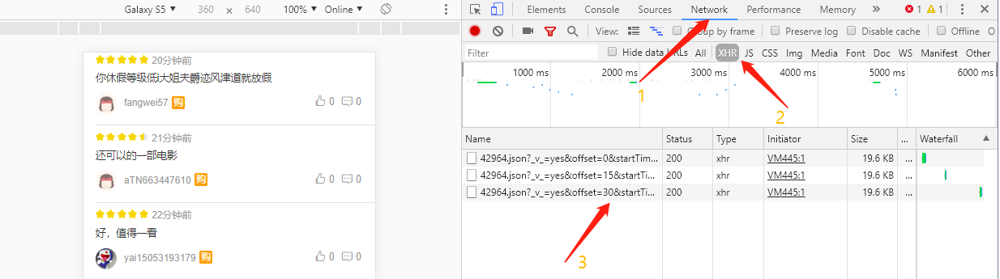
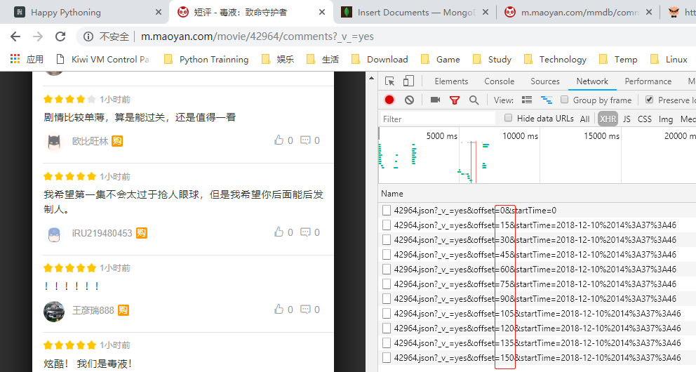
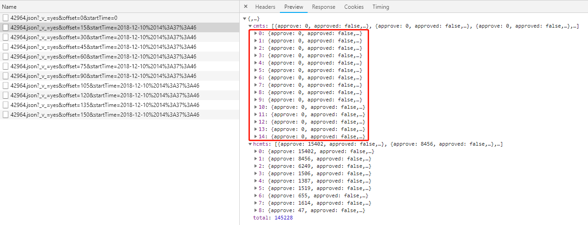
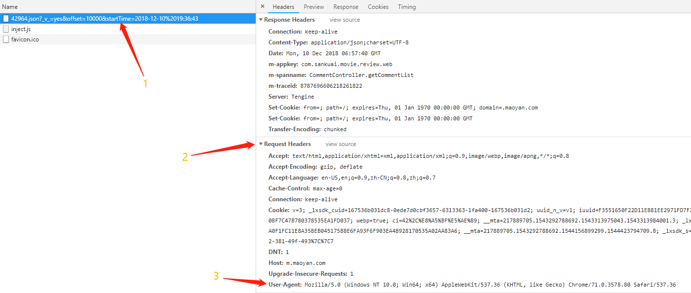

## 访问『毒液』电影页面
1. 访问[猫眼电影](http://www.maoyan.com/)官网 
2. 进入[<<毒液>>](https://maoyan.com/films/42964)页面 
3. 进入开发者模式『F12』
4. 切换到移动端模式『如图』
5. 刷新页面『自动切换到移动端页面』




##  获取数据源地址

1. 下滑页面, 点击"**查看全部xx条评论**"



2. 分析数据源地址及规律『按图中顺序操作』







>按上图来看:
>1. 应该按不同的 offset 来获取数据
>2. 但经过测试按此方法只能获取部分数据
>3. 所以我们将采用 offset=15 不变, 改变 startTime 来获取数据


## 分析原始数据



> 看上图:
> 1. 每条原始数据中含有 15 条普通评论和 9 条热门评论
> 2. 我们只需要 普通评论
> 3. 最终获取的是 data['cmts'] 里的数据


##  MongoDB操作

> myclient = pymongo.MongoClient('127.0.0.1',
> ​                               username='admin',
> ​                               password='password',
> ​                               authMechanism='SCRAM-SHA-256',
> ​                               )
> mydb = myclient['crawlingdata']
> mycol = mydb['venom']


## 补充内容


> 上图为退出循环的条件**『data['total' == 0』**




## 上代码

> 逻辑已经理清, 就不对代码逐行解释了,  咱们直接上代码

```python
# coding = utf-8
import json
import time
from datetime import datetime, timedelta

import pymongo
import requests


class Venom(object):
    @staticmethod
    def get_data(url):
        headers = {
            'user-agent': 'Mozilla/5.0 (Windows NT 10.0; Win64; x64) AppleWebKit/537.36 (KHTML, like Gecko) Chrome/71.0.3578.80 Safari/537.36',
        }
        html = requests.get(url, headers=headers)
        if html.status_code == 200:
            return html.json()
        return None

    def save2mongodb(self):
        # 连接 mongodb 数据库
        myclient = pymongo.MongoClient('127.0.0.1',
                                       username='admin',
                                       password='password',
                                       authMechanism='SCRAM-SHA-256',
                                       )
        mydb = myclient['crawlingdata']
        mycol = mydb['venom']

        # 获取数据『数据是按从新到旧的顺序排列的』
        start_time = datetime.now().strftime('%Y-%m-%d %H:%M:%S')
        end_time = '2018-11-09 00:00:00'

        while start_time &gt;= end_time:
            url = f'http://m.maoyan.com/mmdb/comments/movie/42964.json?_v_=yes&amp;offset=15&amp;startTime={start_time}'
            try:
                html = self.get_data(url)
            except Exception as e:
                time.sleep(0.5)
                html = self.get_data(url)
            else:
                time.sleep(0.1)

            print(start_time)

            # 将数据写入数据库
            if html:
                try:
                    mycol.insert_many(html['cmts'])
                    start_time = html['cmts'][-1]['startTime']
                    start_time = datetime.strptime(start_time, "%Y-%m-%d %H:%M:%S") + timedelta(seconds=-1)
                    start_time = start_time.strftime('%Y-%m-%d %H:%M:%S')
                except KeyError as e:
                    print(html)
                    exit(1)
            else:
                print('Server 没有返回数据')


if __name__ == '__main__':
    venom = Venom()
    venom.save2mongodb()

```

